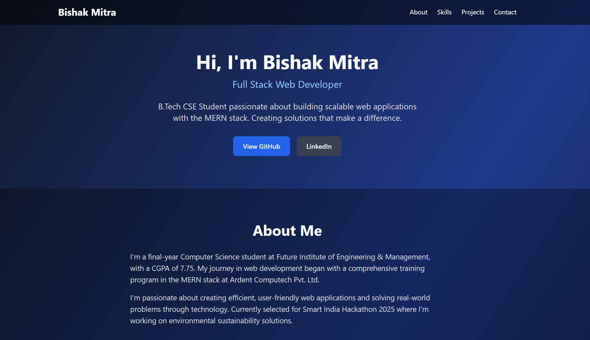
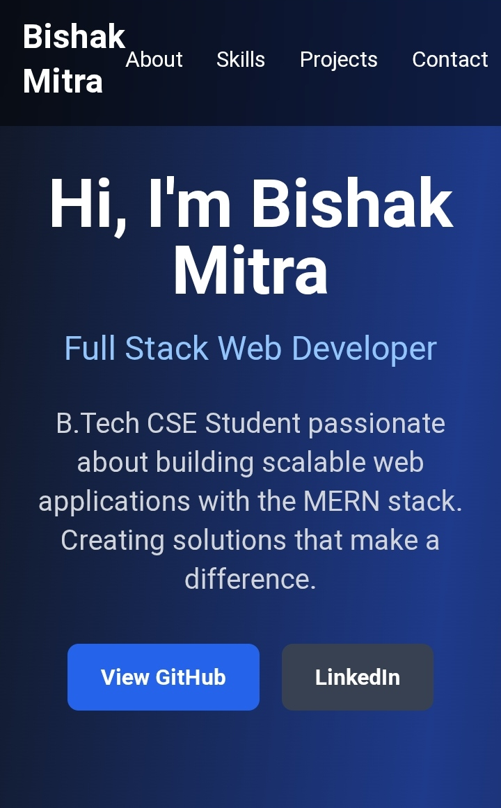
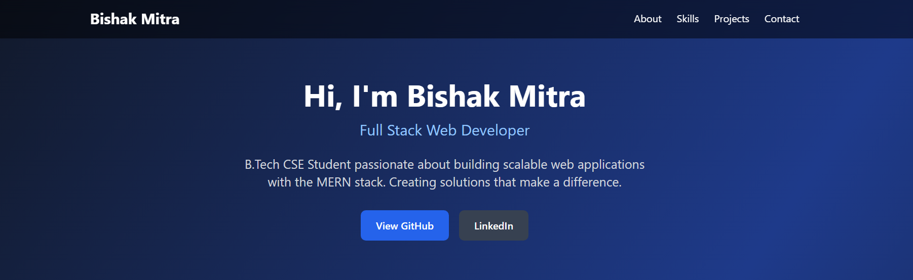
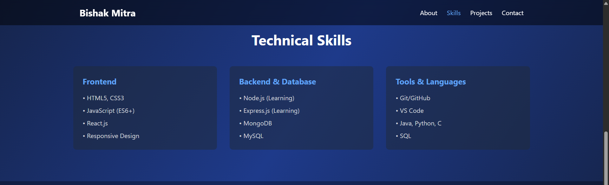
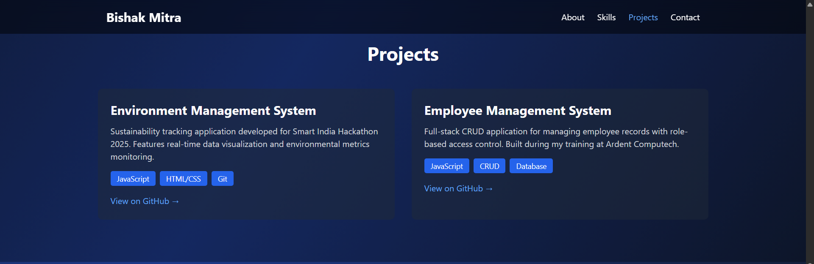
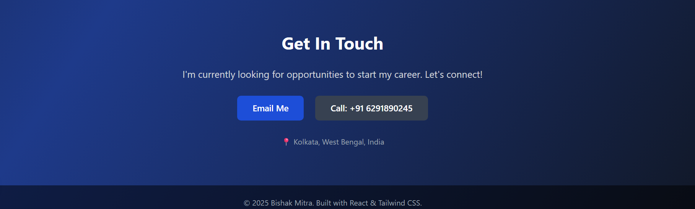

# 🌐 Personal Portfolio Website


A modern, responsive portfolio website built with React.js to showcase my projects, skills, and professional journey as a Full Stack Web Developer.


## 🔗 Live Demo

**Deployed URL:** [bishakmitra.vercel.app](https://bishakmitra.vercel.app/)

**GitHub Repository:** [github.com/JaseWils/my-portfolio](https://github.com/JaseWils/my-portfolio)

---

## 📋 Table of Contents

- [About the Project](#about-the-project)
- [Features](#features)
- [Tech Stack](#tech-stack)
- [Getting Started](#getting-started)
  - [Prerequisites](#prerequisites)
  - [Installation](#installation)
  - [Running Locally](#running-locally)
- [Project Structure](#project-structure)
- [Screenshots](#screenshots)
- [Deployment](#deployment)
- [Future Enhancements](#future-enhancements)
- [Contact](#contact)
- [License](#license)

---

## 🎯 About the Project

This portfolio website serves as my professional digital presence as I begin my career in software development. Built with React.js and modern CSS, it showcases my projects from my training at Ardent Computech and Smart India Hackathon participation, demonstrating my proficiency in full-stack web development.


### Why I Built This

- To have a centralized platform to showcase my work
- To practice React.js and modern CSS techniques
- To create a professional online presence for job applications
- To demonstrate my ability to design and develop complete web applications

---

## ✨ Features

- **Responsive Design:** Fully responsive across all device sizes (mobile, tablet, desktop)
- **Modern UI/UX:** Clean, professional design with smooth animations
- **Interactive Sections:**
  - Hero section with call-to-action buttons
  - About Me section with professional background
  - Skills showcase organized by category
  - Projects gallery with links to live demos and repositories
  - Contact section with multiple contact methods
- **Fast Loading:** Optimized performance with minimal dependencies
- **Cross-browser Compatible:** Works seamlessly on Chrome, Firefox, Safari, and Edge
- **SEO Optimized:** Proper meta tags and semantic HTML
- **Smooth Navigation:** Anchor links for seamless section navigation

---

## 🛠️ Tech Stack

### Frontend
- **React.js** - JavaScript library for building user interfaces
- **CSS3** - Styling with modern CSS features (Flexbox, Grid, Animations)
- **HTML5** - Semantic markup

### Development Tools
- **Visual Studio Code** - Code editor
- **Git & GitHub** - Version control and code hosting
- **npm** - Package management

### Deployment
- **Vercel** - Hosting and continuous deployment
- **GitHub Actions** - CI/CD pipeline (auto-deploys on push to main branch)

---

## 🚀 Getting Started

Follow these instructions to get a local copy up and running.

### Prerequisites

Before you begin, ensure you have the following installed:

- **Node.js** (v14.0 or higher)
  ```bash
  node --version
  ```

- **npm** (v6.0 or higher)
  ```bash
  npm --version
  ```

- **Git**
  ```bash
  git --version
  ```

### Installation

1. **Clone the repository**
   ```bash
   git clone https://github.com/JaseWils/my-portfolio.git
   ```

2. **Navigate to project directory**
   ```bash
   cd my-portfolio
   ```

3. **Install dependencies**
   ```bash
   npm install
   ```

### Running Locally

1. **Start the development server**
   ```bash
   npm start
   ```

2. **Open your browser**
   
   The app will automatically open at [http://localhost:3000](http://localhost:3000)

3. **Make changes**
   
   The page will reload automatically when you save changes to files.

### Build for Production

To create an optimized production build:

```bash
npm run build
```

The build folder will contain the production-ready files.

---

## 📁 Project Structure

```
my-portfolio/
├── public/
│   ├── index.html          # Main HTML file
│   ├── favicon.ico         # Website icon
│   └── manifest.json       # PWA manifest
├── src/
│   ├── App.js              # Main application component
│   ├── App.css             # Application styles
│   ├── index.js            # Entry point
│   └── index.css           # Global styles
├── package.json            # Project dependencies
├── README.md               # Project documentation
└── .gitignore             # Git ignore rules
```

---

## 📸 Screenshots

### Desktop View


### Mobile View


### Hero Section


### Skills Section


### Projects Section


### Contact Section


---

## 🌐 Deployment

This project is deployed on **Vercel** at [my-portfolio-abc123.vercel.app](https://my-portfolio-abc123.vercel.app) with automatic deployments on every push to the main branch.

### Deploy Your Own Copy

1. **Fork this repository** on GitHub

2. **Sign up for Vercel** at [vercel.com](https://vercel.com)

3. **Import your forked repository**
   - Click "New Project"
   - Select your GitHub repository
   - Click "Deploy"

4. **Automatic deployments**
   - Every push to main branch triggers a new deployment
   - Changes go live in ~2 minutes

### Manual Deployment

If you prefer manual deployment:

```bash
npm install -g vercel
vercel
```

---

## 🎨 Customization Guide

### Change Colors

Edit `src/App.css`:

```css

background: linear-gradient(135deg, #0f172a 0%, #1e3a8a 50%, #0f172a 100%);


.btn-primary {
  background: #2563eb; 
}
```

### Update Content

Edit `src/App.js`:

<h2 className="hero-title">Hi, I'm Your Name</h2>
<p className="hero-subtitle">Your Title</p>


### Add New Sections

Add new sections in `src/App.js` following the existing pattern:


<section id="new-section" className="section">
  <div className="container">
    <h2 className="section-title">New Section</h2>
    {/* Your content */}
  </div>
</section>
```

---

## 🔮 Future Enhancements

Planned features and improvements:

- [ ] Add blog section with Markdown support
- [ ] Integrate with a CMS for easy content updates
- [ ] Add dark/light theme toggle
- [ ] Implement contact form with backend
- [ ] Add animations using Framer Motion
- [ ] Include testimonials section
- [ ] Add downloadable resume functionality
- [ ] Implement Google Analytics for visitor tracking
- [ ] Add loading animations
- [ ] Multi-language support

---

## 📊 Performance Metrics

- **Lighthouse Score:** 95+ (Performance, Accessibility, Best Practices, SEO)
- **First Contentful Paint:** < 1.5s
- **Time to Interactive:** < 3.5s
- **Bundle Size:** < 200KB (gzipped)

---

## 🤝 Contributing

While this is a personal portfolio, suggestions and feedback are welcome!

1. Fork the project
2. Create your feature branch (`git checkout -b feature/AmazingFeature`)
3. Commit your changes (`git commit -m 'Add some AmazingFeature'`)
4. Push to the branch (`git push origin feature/AmazingFeature`)
5. Open a Pull Request

---

## 📝 License

This project is open source and available under the [MIT License](LICENSE).

---

## 📞 Contact

**Bishak Mitra**

- **Email:** [bishakmitra@gmail.com](mailto:bishakmitra@gmail.com)
- **LinkedIn:** [linkedin.com/in/bishakmitra](https://linkedin.com/in/bishakmitra)
- **GitHub:** [github.com/JaseWils](https://github.com/JaseWils)
- **Portfolio:** [bishakmitra.vercel.app](https://bishakmitra.vercel.app)
- **Location:** Kolkata, West Bengal, India

---

## 🙏 Acknowledgments

- Design inspiration from modern portfolio websites
- Icons from [Lucide Icons](https://lucide.dev/)
- Deployed on [Vercel](https://vercel.com)
- Built with [Create React App](https://create-react-app.dev/)

---

## 📈 Project Status

**Status:** ✅ Active & Maintained

**Last Updated:** November 2025

**Version:** 1.0.0

---

<div align="center">

### ⭐ If you like this project, please give it a star!

**Made with ❤️ by Bishak Mitra**

</div>